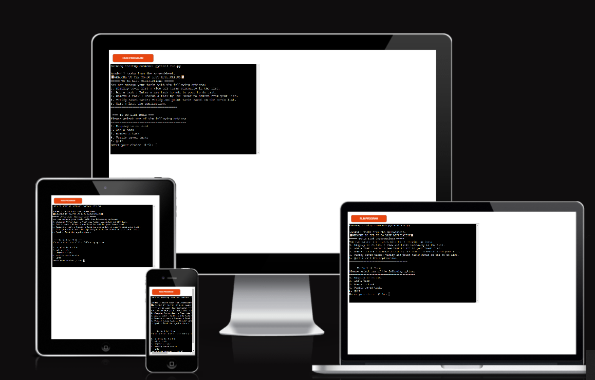

# **TO-DO LIST APPLICATION**
This is a simple command-line to-do list application that allows you to manage your tasks and store them in a Google Sheet using the gspread library. You can add, view, and remove tasks, with each task having a description, due date, and due time.

[View live website here] (https://to-do-l-d6f945e0296e.herokuapp.com/)
![To-Do List responsive design] 

# Table of Content

* [**Project**](<#project>)
    * [Site Users Goal](<#site-users-goal>)
    * [User Stories](<#user-stories>)
    * [Site Owners Goal](<#site-owners-goal>)

* [**User Experience (UX)**](<#user-experience-ux>)
    * [Site Structure](<#site-structure>)
    * [Flow chart](<#flow-chart>)
    * [Data Model](<#data-model>)

## Features

- **Display To-Do List**
- **Add a Task**
- **Remove a Task**
- **Verify Saved Tasks**
- **Load and Save Tasks**

* [**Technologies Used**](<#technologies-used>)
    * [Languages](<#languages>)
    * [Frameworks, Librarys & Software](<#frameworks-libraries--software>)
    * [Python Packages](<#python-packages>)

* [**Testing**](<#testing>)
  * [Code Validation](<#code-validation>)
  * [Additional Testing](<#additional-testing>)
  * [Known Bugs](<#known-bugs>)
* [Deployment](<#deployment>)
* [Credits](<#credits>)
* [Acknowledgements](<#acknowledgements>)

# **Project**

## Site Users Goal
The primary goal of users visiting the To-Do List Application site is to efficiently manage their tasks and stay organized. 

## User Stories
1. Viewing Tasks
As a user, I want to view all my current tasks so that I can see what needs to be done.

Acceptance Criteria:
*The application displays a list of all tasks.
*Each task includes a description, due date, and due time.
*The list is displayed when I select the option to view tasks from the menu.

2. Adding a Task
As a user, I want to add a new task to my to-do list so that I can keep track of new tasks I need to complete.

Acceptance Criteria:
*I can enter a description, due date, and due time for the task.
*The application validates that the due date is not in the past.
*The new task is added to my list and saved to the Google Sheet.

3. Removing a Task
As a user, I want to remove a task from my to-do list so that I can keep my list updated with only relevant tasks.

Acceptance Criteria:
*I can choose a task by its index number to remove it.
*The application asks for confirmation before removing the task.
*The task is removed from the list and the changes are saved to the Google Sheet.

4. Verifying Saved Tasks
As a user, I want to verify the tasks saved in the Google Sheet so that I can ensure my data is stored correctly.

Acceptance Criteria:
*The application fetches and displays all tasks stored in the Google Sheet.
*Each task includes a description, due date, and due time.

5. Loading Tasks on Startup
As a user, I want the application to load my tasks from the Google Sheet when it starts so that I can see my to-do list without manually loading tasks.

Acceptance Criteria:
*When the application starts, it automatically loads tasks from the Google Sheet.
*The tasks are available for viewing, adding, and removing.

6. Quitting the Application
As a user, I want to quit the application so that I can close it when I'm done using it.

Acceptance Criteria:
*I can choose an option to quit the application.
*The application exits cleanly without errors.