# **TO-DO LIST APPLICATION**
This is a simple command-line to-do list application that allows you to manage your tasks and store them in a Google Sheet using the gspread library. You can add, view, and remove tasks, with each task having a description, due date, and due time.

The program automatically syncs all inputs to Google Sheets to ensure storage of and access to the tasks inputed on the to-do list.

Visit the deployed application [here](https://to-do-l-d6f945e0296e.herokuapp.com/)
#

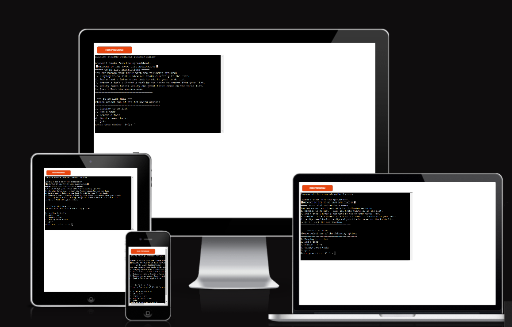

#

# Table of Content

* [**Project**](<#project>)
    * [Site Users Goal](<#site-users-goal>)
    * [User Stories](<#user-stories>)
    * [Site Owners Goal](<#site-owners-goal>)

* [**User Experience (UX)**](<#user-experience-ux>)
    * 
    * [Flow chart](<#flow-chart>)
    * [Data Model](<#data-model>)

## Features
* [Welcome Screen and Instructions](#welcome-screen-and-instructions)
* [Display To-Do List](#display-to-do-list)
* [Add Task](#add-task)
* [Remove Task](#remove-task)
* [Verify Saved Tasks](#verify-saved-task)
* [Load Task](#load-tasks)
* [Quit Application](#quit-application)

* [**Technologies Used**](<#technologies-used>)
    * [Languages](<#languages>)
    * [Frameworks, Librarys & Software](<#frameworks-libraries--software>)

* [**Testing**](<#testing>)
  * [Code Validation](<#code-validation>)
  * [Testing](<#testing>)
  * [Bugs](<#bugs>)
* [Deployment](<#deployment>)
* [Credits](<#credits>)
* [Acknowledgements](<#acknowledgements>)

# **Project**

## Site Users Goal
The primary goal of users visiting the To-Do List Application site is to efficiently manage their tasks and stay organized.
- Users want to easily manage their tasks, including adding, viewing, and removing tasks.
- Users want to organize their tasks by due dates and times to prioritize their workload effectively.
- Users want their tasks to be saved and retrievable across sessions, ensuring no data is lost.
- Users want a simple and intuitive interface to manage their tasks without a steep learning curve.
 

## User Stories
1. Viewing Tasks
As a user, I want to view all my current tasks so that I can see what needs to be done.

* The application displays a list of all tasks.
* Each task includes a description, due date, and due time.
* The list is displayed when I select the option to view tasks from the menu.

2. Adding a Task
As a user, I want to add a new task to my to-do list so that I can keep track of new tasks I need to complete.

* I can enter a description, due date, and due time for the task.
* The application validates that the due date is not in the past.
* The new task is added to my list and saved to the Google Sheet.

3. Removing a Task
As a user, I want to remove a task from my to-do list so that I can keep my list updated with only relevant tasks.

* I can choose a task by its index number to remove it.
* The application asks for confirmation before removing the task.
* The task is removed from the list and the changes are saved to the Google Sheet.

4. Verifying Saved Tasks
As a user, I want to verify the tasks saved in the Google Sheet so that I can ensure my data is stored correctly.

* The application fetches and displays all tasks stored in the Google Sheet.
* Each task includes a description, due date, and due time.

5. Loading Tasks on Startup
As a user, I want the application to load my tasks from the Google Sheet when it starts so that I can see my to-do list without manually loading tasks.

* When the application starts, it automatically loads tasks from the Google Sheet.
* The tasks are available for viewing, adding, and removing.

6. Quitting the Application
As a user, I want to quit the application so that I can close it when I'm done using it.

* I can choose an option to quit the application.
* The application exits cleanly without errors.

## Site Owner's Goal
The goal of the site owners for the To-Do List Application is to provide a robust, user-friendly platform that meets the needs of users while maintaining operational efficiency and scalability.

[Back to top](<#table-of-content>)

# **User Experience**
## Flow Chart
[Lucid App](https://lucid.app/) was used in creating the flow chart for this application, the flow chart was created prior to starting the project as this gave an insight into what the project entails which made writing the code easy. It also provide the user with an idea of how the application runs.

<b>Flow Chart</b>

![Flow Chart]

 

[Back to top](<#table-of-content>)

## Data Model
To store all the tasks in the application, I used a [Google Sheet](https://www.google.com/sheets/about/). All the tasks inputed into the application are stored in the google sheet and can also be retrieved from the google sheet.

Each task in the to-do list has the following attributes:
* Description: A brief text describing the task.
* Due Date: The date by which the task is to be completed (in YYYY-MM-DD format).
* Due Time: The time by which the task is to be completed (in HH:MM format).

These attributes are represented in the Google Sheet and locally within the application.

<b>Google Sheet</b>

![Google Sheet]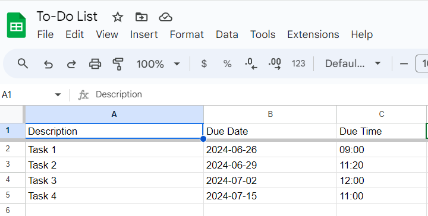

The view only version of the google sheet can be viewed [here](https://docs.google.com/spreadsheets/d/1RTZ_kWXGWAtH2YPAVOANknrq1FwICjXvHEyGpnd7_HU/edit?gid=2026798872#gid=2026798872)

 

[Back to top](<#table-of-content>)

### Typography
To ensure the readability and usability of the To-Do List application, the following typography guidelines can be adopted.
* Font: Monospaced (default terminal font)
* Style: ASCII Art for logo, bold text for headings
* Color: Default terminal color (often white on black)

[Back to top](<#table-of-content>)

## Features
### Welcome Screen and Instructions
- When the application starts, it diplays an ASCII art banner informing the users of what the application is, followed by the list of detailed instructions. 

<b>Welcome Screen</b>

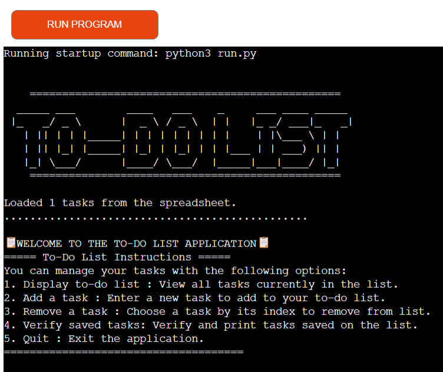

 

[Back to top](<#table-of-content>)

### Menu List
- The menu list option guides the users on how to use the application. It consists of 5 choices

<b>Menu List</b>

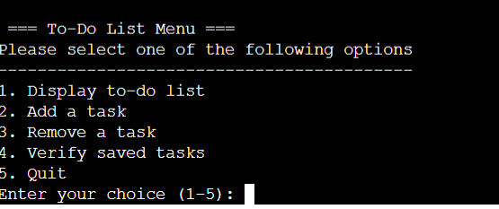

 

### Load Task
- Loads tasks from a Google Sheet into the local application.
- Ensures that tasks are up-to-date and synchronized between the local list and the Google Sheet.

<b>Load Task</b>

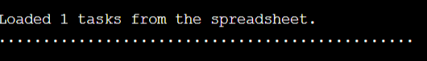

 

### Display To-Do List
- Lists all tasks currently in the to-do list.
- Displays task details including description, due date, and due time.

<b>Display To-Do List</b>

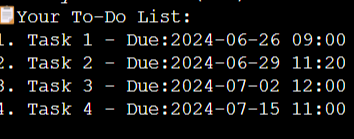

 

### Add Task
- Allows users to add a new task to the to-do list.
- Prompts for task description, due date, and due time.
- Validates the input to ensure the due date and time are not in the past.
- Error messages inform users of incorrect inputs.
- Saves the new task to the Google Sheet.

<b>Add Task</b>

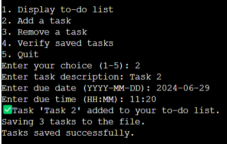

 

### Remove Task
- Enables users to remove a task by selecting its index from the list.
- Confirms task removal to prevent accidental deletions.
- Updates the Google Sheet to reflect the removal.

<b>Remove Task</b>

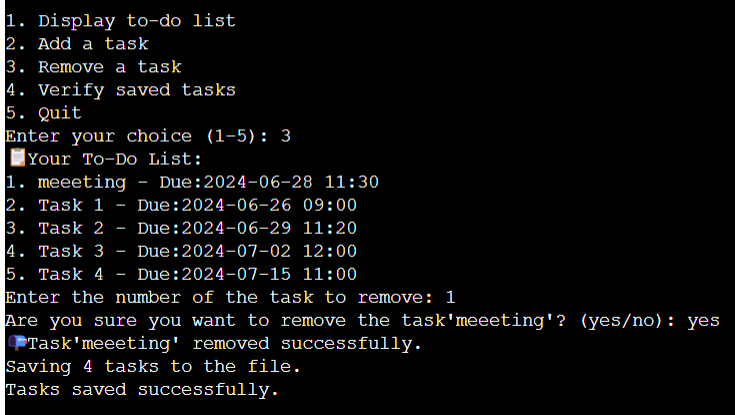

 

### Verify Saved Task
- Reads and prints tasks currently saved in the Google Sheet.
- Provides a way to verify that tasks are correctly saved and synchronized.

<b>Verify Saved Task</b>

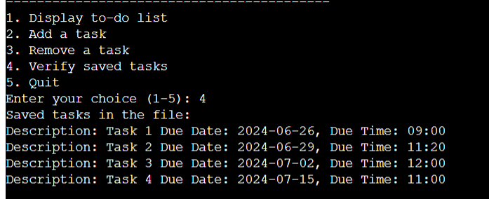

 

### Quit Application
- The quit application choice signifies the end of the program.

<b>Quit Application</b>

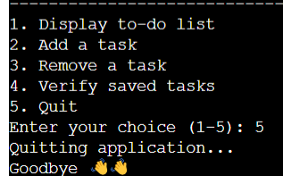

 

[Back to top](<#table-of-content>)

### Future Features

#### Task priortization

* Allow users to assign priority levels (e.g., high, medium, low) to tasks.
* Display tasks sorted by priority to help users focus on the most important tasks first.

#### Task Categories

* Enable users to categorize tasks (e.g., work, personal, urgent).
* Filter and display tasks based on selected categories.

#### Search and Filter Task

* Implement a search feature to find tasks by keywords in the description.
* Add filtering options to view tasks by due date, due time, or priority

#### Task Completion and Progress Tracking

* Add the ability for users to mark tasks as complete.
* Track and display the percentage of completed tasks.
* Option to archive completed tasks for future reference.

#### Notifications and Reminders

* Implement email or SMS notifications to remind users of upcoming due dates and times.
* Provide in-app reminders and alerts for tasks nearing their due time.

[Back to top](<#table-of-content>)

## Technologies Used

### Languages

- [Python3](https://en.wikipedia.org/wiki/Python_(programming_language)). This provides functionality for the application.
- Code Institute's [Python Essentials Template](https://github.com/Code-Institute-Org/python-essentials-template) 
- [HTML5](https://en.wikipedia.org/wiki/HTML5)
- [Javascript](https://en.wikipedia.org/wiki/JavaScript)

[Back to top](<#table-of-content>)

## Frameworks, Libraries & Software
- [Datetime](https://docs.python.org/3/library/datetime.html) - used to validate date and time inputs.
- [Google Cloud](https://cloud.google.com/) - used to generate the APIs required to connect the spreadsheets with the Python code.
- [GSpread](https://docs.gspread.org/en/v6.0.0/) - used to interact with the data in the linked sheet and used to store user input data.
- [GitHub](https://github.com/) - used to host and store and edit the project.
- [GitPod](https://gitpod.io/) - used for writing code.
- [GitBash](https://en.wikipedia.org/wiki/Bash_(Unix_shell)) - Terminal in [Gitpod](https://www.gitpod.io) used to push changes to the GitHub repository. 
- [Heroku](https://dashboard.heroku.com/login) - used to host and deploy the finished project.
- [Lucidchart](https://www.lucidchart.com/pages/) - used to create the flowchart during project planning.
- [PEP8 online check](http://pep8online.com/) was used to validate the Python code.

[Back to top](<#table-of-content>)

# Testing
## Code Validation
[Pep8 Linter](https://pep8ci.herokuapp.com/#) was used to validate the python code and no error was returned in the final testing.

<b>PEP Validation Result</b>

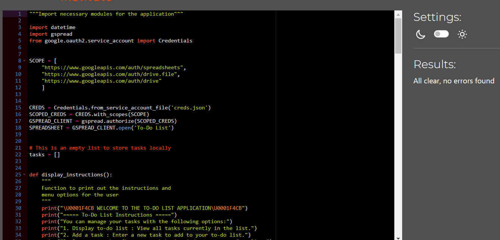

 

*.Html* and *.Javascript* were provided by the Code Institute through [Python Essentials Template](https://github.com/Code-Institute-Org/python-essentials-template).

[Back to top](<#table-of-content>)

### Browser Compatibility
The following browsers was used to test for appearance and functionality issues, only Safari has functionality issues as no user input is recognized on Safari.

* Google Chrome 
* Mozilla Firefox 
* Microsoft Edge 
* Safari - Functionality Issues
* Opera

[Back to top](<#table-of-content>)

### Bugs
- My mentor found a bug in the add task function. The bug made it possible for the user to input empty strings (which means that empty cells/rows was saved to the Google Sheet), The bug was fixed by changing the function and adding a validation to check for empty inputs.
- During a session with my mentor, he found out that dates from the past can be added to the task by the user. This bug was fixed by updating the function to only allow for current and future dates to be added to the to-do list.
- While validating my codes on PEP8 Linter, There were error alerts regarding the 79 character limits, I used the backslash to split the lines of code but it ended up creating unusal spacing so I resolved this error by splitting the input statements across multiple lines while ensuring that they are not more than 79 characters. 
- Instructions were not aligning to the left of the screen which made the program look disorganized, I resolved this by adding a print statement to each instruction message.

[Back to top](<#table-of-content>)

### Accessibility

[Lighthouse](https://developer.chrome.com/docs/lighthouse/overview) in [Chrome DevTools](https://developer.chrome.com/docs/devtools/) was used to measure the quality of the page, focusing on performance, accessibility, best practices, and SEO scores.

<b>Lighthouse Report</b>

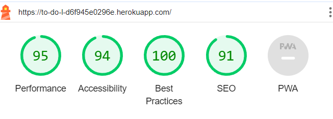

 

[Back to top](<#table-of-content>)

## Deployment

### Google Sheet

- Google Sheets API and Google Drive API have to be used for this project; these could be accessed via [Google Cloud Platform] (https://cloud.google.com).
- The Google Drive API was used to build a credentials file, which was then added to the workspace.
- The credentials file was placed to *gitignore* in order to prevent sensitive data from being pushed to the repository.
- To grant access, the client_email address from the credentials file was added to Google Sheets as an editor.
- The *run.py* file's header contained definitions for the variables and the scope of access to the worksheet.
- The OAuth and GSpread packages were installed using the terminal.

[Back to top](<#table-of-content>)

### Deployment to Heroku

1. Update your *requirements.txt* file
    - Run pip3 freeze > requirements.txt' in the terminal to add a list of dependencies to *requirements.txt*.
    - Commit and push the changes to Github.
2. Log in to Heroku or (Create new account if required) and from the top right corner of the dashboard, click *Create New App*.
    - Enter an app name and choose your region.
    Click *Create App*.
3. Go to *Settings* and update the *ConfigVars*.
    - Click *Reveal ConfigVars* and add the following information:
        - KEY = 'CREDS', VALUE = Copy and paste the entire contents of the creds.json file into this field.
        - KEY = 'PORT', VALUE = '8000'.
    - Click *Add* after entering each *ConfigVar*.
4. Within *Settings*, update the *Buildpacks*.
    - Click *Add Buildpack* and add the following buildpacks:
        - Add *Python* and click *Add Buildpack*.
        - Add *NodeJS* and click *Add Buildpack*.
        - Make sure the Python buildpack is above the NodeJS buildpack.
5. Go to *Deploy* and specify deployment details.
    - Select *GitHub* as the *Deployment Method*.
        - When prompted to *Connect to GitHub*, find your repository and click *Connect*.
    - Select either *Automatic Deploys* or *Manual Deploys* and click *Deploy Branch*.
6. Once deployment has been completed, click *View* to view the deployed project. 
 
[Back to top](<#table-of-content>)

## Create A Local Clone of A Project

To create a local clone of your repository, follow these steps:

1. When you are in the repository, find the code tab and click it.
2. To the left of the green GitPod button, press the 'code' menu. There you will find a link to the repository. Click on the clipboard icon to copy the URL.
3. Use an IDE and open Git Bash. Change directory to the location where you want the cloned directory to be made.
4. Type 'git clone', and then paste the URL that you copied from GitHub. Press enter and a local clone will be created.

[Back to top](<#table-of-content>)

# Credit

## Content
- All content was written by the developer.
- The ASCII art To-Do List logo was generated using [patorjk.com](https://patorjk.com/software/taag/#p=display&h=3&v=3&f=Standard&t=TO-DO%20LIST).
- The unicode emoji was used to add decorative emojis to my application [Unicode](https://unicode.org/emoji/charts/full-emoji-list.html#1f4e9).
- The idea for setting up the gspread for this project was gotten from the Love Sandwiches code along video.

[Back to top](<#table-of-content>)

## Acknowledgements

I will like to thank my mentor Precious Ijege for his suggestions and feedback during this project.
I will also like to thank the staff and students on the slack platform for their contributions and prompt responses to my challenges.

